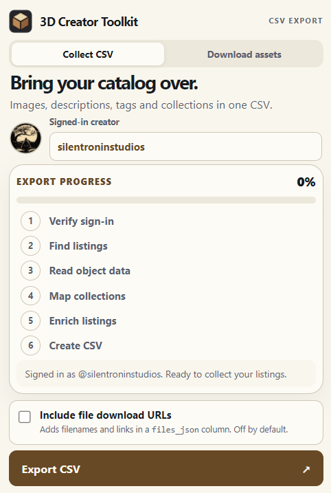
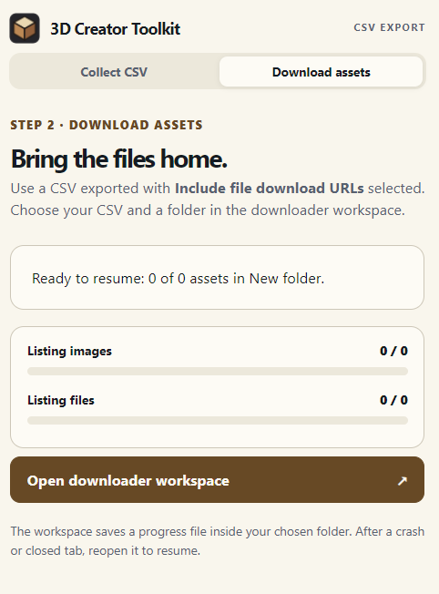
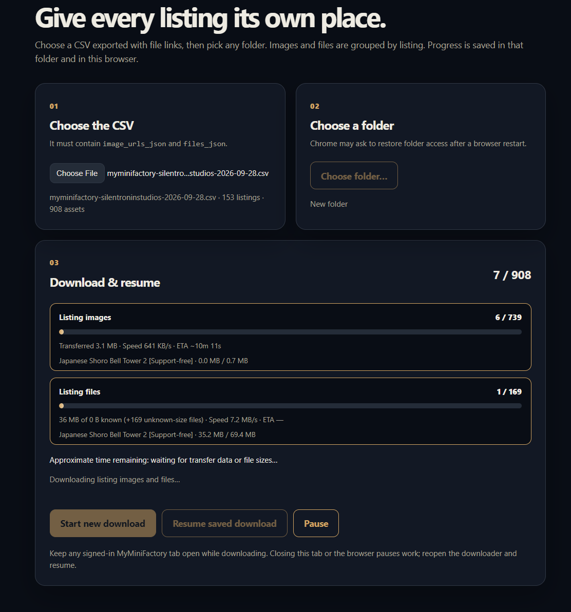

# 3D Creator Toolkit

Export **your own public MyMiniFactory object listings** to a CSV. Optionally download their images and model files into a folder you choose. The extension uses your existing MyMiniFactory sign-in; it never asks you for a password.

## Install in Brave or Chrome

1. **[Download the latest extension ZIP](https://github.com/3dcreatortoolkit/mmf-creator-toolkit/releases/latest/download/3d-creator-toolkit.zip)** and extract it to a folder you will keep. You do **not** need Node.js or a build step.
2. Open `brave://extensions` or `chrome://extensions` and enable **Developer mode**.
3. Click **Load unpacked** and select the **extracted folder containing `manifest.json`**—not the ZIP. You should see the cube icon for 3D Creator Toolkit.
4. Sign in to [MyMiniFactory](https://www.myminifactory.com/) as the creator whose listings you want to export. Leave a MyMiniFactory tab open.

You can pin the extension to your toolbar for easier access.

## 1. Export your listings to CSV

1. Click the extension icon. **Collect CSV** is selected by default; confirm it shows **your username and avatar**. The account is detected automatically and cannot be edited in the popup.
2. If you only want a listing spreadsheet, leave **Include file download URLs** unchecked. **Check it before exporting if you also want to download model files** in step 2.
3. Click **Export CSV**. Keep your MyMiniFactory tab open until the CSV appears in your browser's Downloads. You can reopen the popup to check progress.



The CSV includes public object titles, prices, descriptions, tags, categories, collections, and image URLs. It does **not** include private objects or bundles. With the checkbox selected, it also includes file names, download URLs, and sizes when MyMiniFactory provides them. Keep a CSV with download links private: those links can expire.

## 2. Download images and files (optional)

### Brave users: enable the folder picker first

**CSV export works without this setting.** Downloading assets into a folder you choose needs the browser's **File System Access API**. It lets the workspace create a folder for each listing, save files there, and access the same folder again when you resume. Selecting a CSV alone does not grant that access.

Brave disables the API by default:

1. Open `brave://flags/#file-system-access-api`.
2. Set **File System Access API** to **Enabled** and click **Relaunch**.
3. Reopen the downloader workspace. The browser will still ask you to choose and grant access to a folder.

This is a browser-wide experimental setting. Enable it only if you are comfortable granting folder access to applications you trust. Chrome generally provides the picker without changing a flag.

### Start the download

1. In the popup, select **Download assets** and click **Open downloader workspace**.

   

2. **Choose the CSV you exported with file download URLs included**, then click **Choose folder** and select the destination. Keep a signed-in MyMiniFactory tab open.
3. Click **Start new download**. The workspace downloads images and files concurrently and shows separate progress, speed, and approximate remaining-time estimates.

   

Files are organized as follows:

```text
Your chosen folder/
  3d-creator-toolkit-progress.json
  listings/
    Listing title/
      images/
      files/
```

The extension makes folder and image names safe for your filesystem and distinguishes duplicates. The progress file records completed assets; it does **not** store signed download links. Remaining-time estimates are only estimates and may be unavailable until some data has transferred.

## Pause, resume, and update

- To stop temporarily, click **Pause**. If you close the workspace or browser, reopen **Download assets → Open downloader workspace** and click **Resume saved download**. The browser may ask for folder permission again. Completed files are checked before being skipped.
- A temporary network error is retried automatically. If MyMiniFactory responds with **429**, the downloader waits five seconds and tries again; you can still click Pause. If a download pauses for another reason, its error remains visible when you reopen the workspace.
- If a file link expires, sign in as the **same creator**, export a fresh CSV with file links, and start again in the same folder to reuse finished assets. Switching creators hides the previous creator's saved job until you sign back in.
- **To update the extension without losing its saved job:** pause the downloader, extract the new ZIP **over the same installed extension folder**, replace its files, and click **Reload** on the existing extension card in `brave://extensions` or `chrome://extensions`. Do not remove it and load a different folder; that can change the extension ID and separate it from browser-stored progress. Refresh your MyMiniFactory tab if the updated extension cannot connect.

Building or releasing the extension? See the separate [maintainer guide](docs/development.md).
